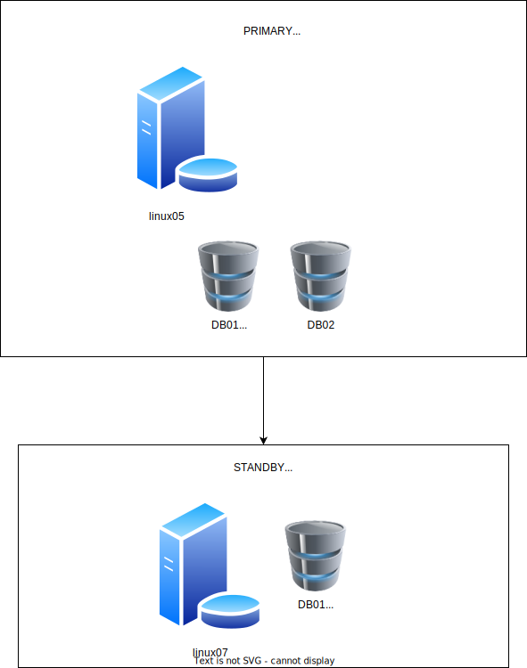
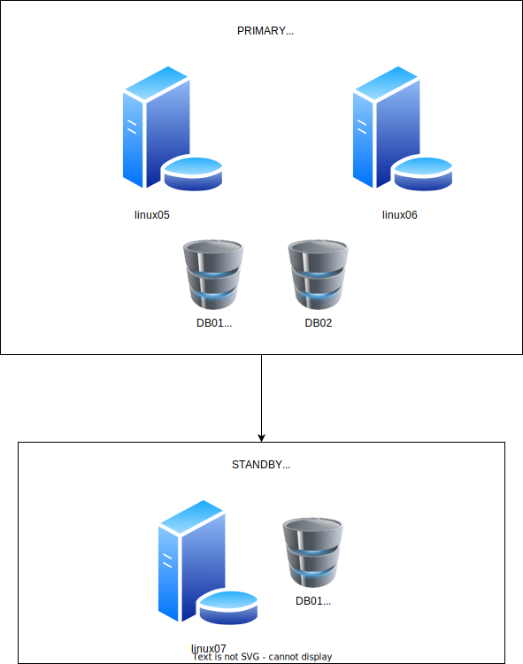

<!-- ---
documentclass: article
lang: pt-BR

title: Procedimento para conversão de Single-Instance para RAC 12c
author: Lucas Pimentel Lellis
--- -->

# Procedimento para Conversão de Single-Instance para RAC 12c

## Objetivo

Documentar o processo de conversão in-place de bases Single-Instance para RAC na versão 12.1.0.2.

A conversão observará os seguintes passos:

* Clone da máquina original para criar o nó 2
* Deconfig do Grid Infrastructure - nó 2
* Detach do Grid Infrastructure - nó 2
* Attach do Grid Infrastructure - nó 2
* Config do Grid Infrastructure em modo cluster - nó 2
* Relink dos binários do Oracle Database ativando a option de RAC - nó 2
* Stop das instâncias - nó 1
* Subida das instâncias, configuração de parâmetros, tablespace de undo, redo logs e serviços - nó 2
* Deconfig do Grid Infrastructure - nó 1
* Detach do Grid Infrastructure - nó 1
* Attach do Grid - nó 1
* add_node.sh do nó 1 - executado a partir do nó 2

## Estrutura

* Cenário Inicial

  

* Cenário Final

  

* Dados das Máquinas

  |            | Primary        | Primary        | Standby         |
  |------------|----------------|----------------|-----------------|
  |            | Nó 1           | Nó 2           | Single-Instance |
  | Hostname   | linux05        | linux06        | linux07         |
  | IP público | 192.168.49.15  | 192.168.49.16  | 192.168.49.17   |
  | IP privado | 192.168.39.15  | 192.168.39.16  | 192.168.39.17   |
  | VIP        | 192.168.49.215 | 192.168.49.216 | 192.168.49.217  |
  | Porta VNC  | 55906          | 55907          | 55908           |

  | SCAN       | IP             |
  |------------|----------------|
  | rac01-scan | 192.168.49.203 |
  | rac01-scan | 192.168.49.204 |
  | rac01-scan | 192.168.49.205 |

  | Disco     | Tamanho (GB) |
  |-----------|-------------:|
  | u01       |           80 |
  | OCRVOTE01 |           10 |
  | OCRVOTE01 |           10 |
  | OCRVOTE01 |           10 |
  | DATA01    |           20 |
  | FRA01     |           20 |

## Configuração do Nó 2

### Configure o Login Sem Senha via SSH

Após adicionar as chaves públicas no `.ssh/authorized_keys` de cada nó, execute os comandos abaixo para que as
assinaturas de cada máquina estejam presentes no `.ssh/known_hosts` de cada máquina:

```{.default .NumberLines}
ssh linux05 date
ssh linux06 date
ssh linux05-priv date
ssh linux06-priv date
```

### Clone do Nó 1

Foi feito o clone do disco correspondente ao /u01 do nó 1. Além disso, foram apresentados para o nó 2 os mesmos discos de ASM do nó 1.

### Deconfig do Grid Infrastructure - Nó 2

Executar com o usuário root:

```{.bash .numberLines}
/u01/app/grid/12.1.0.2/perl/bin/perl /u01/app/grid/12.1.0.2/crs/install/roothas.pl -deconfig -force
```

Resultado:

```default
[root@linux06 ~]# /u01/app/grid/12.1.0.2/perl/bin/perl /u01/app/grid/12.1.0.2/crs/install/roothas.pl -deconfig -force
Using configuration parameter file: /u01/app/grid/12.1.0.2/crs/install/crsconfig_params
2023/11/22 18:23:02 CLSRSC-348: The Oracle Restart stack failed to stop

Died at /u01/app/grid/12.1.0.2/crs/install/crsdeconfig.pm line 1341.
[root@linux06 ~]#
```

Altere as permissões dos arquivos:

```{.bash .numberLines}
cd /u01/app

chown -R oracle:oinstall grid
```

Resultado:

```default
[root@linux06 ~]# cd /u01/app
[root@linux06 app]#
[root@linux06 app]# chown -R oracle:oinstall grid
[root@linux06 app]#
```

### Detach do Grid Infrastructure - nó 2

Executar com o usuário oracle (ou grid, caso faça a separação):

```{.bash .numberLines}
cd /u01/app/grid/12.1.0.2/clone/bin

/u01/app/grid/12.1.0.2/perl/bin/perl clone.pl -detachHome ORACLE_BASE=/u01/app/grid ORACLE_HOME=/u01/app/grid/12.1.0.2 ORACLE_HOME_NAME=OraGI12Home1 ORACLE_HOME_USER=oracle INVENTORY_LOCATION=/u01/app/oraInventory -local
```

Resultado:

```default
[oracle@linux06 db01 bin]$ /u01/app/grid/12.1.0.2/perl/bin/perl clone.pl -detachHome ORACLE_BASE=/u01/app/grid ORACLE_HOME=/u01/app/grid/12.1.0.2 ORACLE_HOME_NAME=OraGI12Home1 ORACLE_HOME_USER=oracle INVENTORY_LOCATION=/u01/app/oraInventory
./runInstaller -clone -waitForCompletion  -detachHome  "ORACLE_BASE=/u01/app/grid" "ORACLE_HOME=/u01/app/grid/12.1.0.2" "ORACLE_HOME_NAME=OraGI12Home1" "ORACLE_HOME_USER=oracle" "INVENTORY_LOCATION=/u01/app/oraInventory" -silent -paramFile /u01/app/grid/12.1.0.2/clone/clone_oraparam.ini
Starting Oracle Universal Installer...

Checking Temp space: must be greater than 500 MB.   Actual 124938 MB    Passed
Checking swap space: must be greater than 500 MB.   Actual 20478 MB    Passed
The inventory pointer is located at /etc/oraInst.loc
'DetachHome' was successful.
[oracle@linux06 db01 bin]$
```

### Limpe o Home do Grid Infrastructure - Nó 2

Executar com o usuário root:

```{.bash .numberLines}
export GRID_HOME=/u01/app/grid/12.1.0.2
rm -rf $GRID_HOME/host_name
rm -rf $GRID_HOME/log/host_name
rm -rf $GRID_HOME/gpnp/*
rm -rf $GRID_HOME/bin/clsecho/*
rm -rf $GRID_HOME/crs/init/*
rm -rf $GRID_HOME/cdata/*
rm -rf $GRID_HOME/crf/*
rm -rf $GRID_HOME/network/admin/*.ora
rm -rf $GRID_HOME/root.sh*
rm -rf $GRID_HOME/cfgtoollogs/*
rm -rf $GRID_HOME/crs/install/crsconfig_params
rm -rf $GRID_HOME/rdbms/audit/*
rm -rf $GRID_HOME/rdbms/log/*
rm -rf $GRID_HOME/inventory/backup/*
rm -rf /u01/app/grid/{admin,cfgtoollogs,checkpoints,crsdata,diag,linux05,log}
find $GRID_HOME -name '*.ouibak*' -delete
```

### Attach do Grid Infrastructure - Nó 2

Como o Oracle Home do GI em modo cluster não pode ficar abaixo do Oracle Base, será necessário alterar o Oracle Base
de `/u01/app/grid` para `/u01/app/grid/grid`, enquanto que o Oracle Home permanece como `/u01/app/grid/12.1.0.2`.

Executar com o usuário oracle (ou grid, caso faça a separação):

(O `clone.pl` irá solicitar a execução dos scripts `orainstRoot.sh` e `root.sh`, mas apenas o `orainstRoot.sh` deve ser executado)

```{.bash .numberLines}
cd /u01/app/grid/12.1.0.2/clone/bin

/u01/app/grid/12.1.0.2/perl/bin/perl clone.pl -silent ORACLE_BASE=/u01/app/grid/grid ORACLE_HOME=/u01/app/grid/12.1.0.2 ORACLE_HOME_NAME=OraGI12Home1 INVENTORY_LOCATION=/u01/app/oraInventory LOCAL_NODE=linux06 CRS=TRUE
```

Resultado:

```default
[oracle@linux06 db01 bin]$ cd /u01/app/grid/12.1.0.2/clone/bin
[oracle@linux06 db01 bin]$ mkdir /u01/app/grid/grid
[oracle@linux06 db01 bin]$ /u01/app/grid/12.1.0.2/perl/bin/perl clone.pl -silent ORACLE_BASE=/u01/app/grid/grid ORACLE_HOME=/u01/app/grid/12.1.0.2 ORACLE_HOME_NAME=OraGI12Home1 INVENTORY_LOCATION=/u01/app/oraInventory LOCAL_NODE=linux06 CRS=TRUE
./runInstaller -clone -waitForCompletion  "ORACLE_BASE=/u01/app/grid/grid" "ORACLE_HOME=/u01/app/grid/12.1.0.2" "ORACLE_HOME_NAME=OraGI12Home1" "INVENTORY_LOCATION=/u01/app/oraInventory" "LOCAL_NODE=linux06" "CRS=TRUE" -silent -paramFile /u01/app/grid/12.1.0.2/clone/clone_oraparam.ini
Starting Oracle Universal Installer...

Checking Temp space: must be greater than 500 MB.   Actual 124938 MB    Passed
Checking swap space: must be greater than 500 MB.   Actual 20478 MB    Passed
Preparing to launch Oracle Universal Installer from /tmp/OraInstall2023-11-22_06-37-26PM. Please wait ...You can find the log of this install session at:
 /u01/app/oraInventory/logs/cloneActions2023-11-22_06-37-26PM.log
..................................................   5% Done.
..................................................   10% Done.
..................................................   15% Done.
..................................................   20% Done.
..................................................   25% Done.
..................................................   30% Done.
..................................................   35% Done.
..................................................   40% Done.
..................................................   45% Done.
..................................................   50% Done.
..................................................   55% Done.
..................................................   60% Done.
..................................................   65% Done.
..................................................   70% Done.
..................................................   75% Done.
..................................................   80% Done.
..................................................   85% Done.
..........
Copy files in progress.

Copy files successful.

Link binaries in progress.

Link binaries successful.

Setup files in progress.

Setup files successful.

Setup Inventory in progress.

Setup Inventory successful.

Finish Setup successful.
The cloning of OraGI12Home1 was successful.
Please check '/u01/app/oraInventory/logs/cloneActions2023-11-22_06-37-26PM.log' for more details.

Setup Oracle Base in progress.

Setup Oracle Base successful.
..................................................   95% Done.

As a root user, execute the following script(s):
        1. /u01/app/oraInventory/orainstRoot.sh
        2. /u01/app/grid/12.1.0.2/root.sh


..................................................   100% Done.
[oracle@linux06 db01 bin]$ sudo /u01/app/oraInventory/orainstRoot.sh
Changing permissions of /u01/app/oraInventory.
Adding read,write permissions for group.
Removing read,write,execute permissions for world.

Changing groupname of /u01/app/oraInventory to oinstall.
The execution of the script is complete.
```

### Instale o RPM do cluvfy

Executar com o root:

```{.bash .numberLines}
yum install -y /u01/app/grid/12.1.0.2/cv/rpm/cvuqdisk-1.0.9-1.rpm
```

### Config do Grid Infrastructure em Modo Cluster - Nó 2

Para configurar o GI em cluster usando modo texto, é necessário definir o response file:

```{.default .numberLines}
oracle.install.responseFileVersion=/oracle/install/rspfmt_crsinstall_response_schema_v12.1.0

ORACLE_HOSTNAME=linux06

INVENTORY_LOCATION=/u01/app/oraInventory

SELECTED_LANGUAGES=en

oracle.install.option=CRS_CONFIG

ORACLE_BASE=/u01/app/grid/grid

ORACLE_HOME=/u01/app/grid/12.1.0.2

oracle.install.asm.OSDBA=asmdba

oracle.install.asm.OSOPER=asmoper

oracle.install.asm.OSASM=asmadmin

oracle.install.crs.config.gpnp.scanName=rac01-scan

oracle.install.crs.config.gpnp.scanPort=1521

oracle.install.crs.config.ClusterType=STANDARD

oracle.install.crs.config.clusterName=rac01

oracle.install.crs.config.gpnp.configureGNS=false

oracle.install.crs.config.autoConfigureClusterNodeVIP=false

oracle.install.crs.config.clusterNodes=linux06:linux06-vip

oracle.install.crs.config.networkInterfaceList=eth1:192.168.49.0:1,eth2:192.168.39.0:2

oracle.install.crs.config.storageOption=LOCAL_ASM_STORAGE

oracle.install.crs.config.sharedFileSystemStorage.votingDiskRedundancy=NORMAL

oracle.install.crs.config.sharedFileSystemStorage.ocrRedundancy=NORMAL

oracle.install.asm.SYSASMPassword=<DEFINIR SENHA>

oracle.install.asm.diskGroup.name=OCRVOTE

oracle.install.asm.diskGroup.redundancy=NORMAL

oracle.install.asm.diskGroup.AUSize=1

oracle.install.asm.diskGroup.disks=ORCL:OCRVOTE01,ORCL:OCRVOTE02,ORCL:OCRVOTE03

oracle.install.asm.diskGroup.diskDiscoveryString=ORCL:*

oracle.install.asm.monitorPassword=<DEFINIR SENHA>

oracle.install.config.managementOption=NONE

[ConfigWizard]
oracle.install.asm.useExistingDiskGroup=false
[ConfigWizard]
```

O arquivo de template com as instruções pode ser consultado em `/u01/app/grid/12.1.0.2/inventory/response/grid_install.rsp`.

Defina as senhas das linhas 43 e 55 e crie o arquivo com o nome grid_config.rsp no home do usuário oracle.

Execute o script de config com o usuário oracle e cheque a conformidade com os pré-requisitos:

```{.bash .numberLines}
cd /u01/app/grid/12.1.0.2/crs/config

./config.sh -silent -responseFile ~/grid_config.rsp -executePrereqs
```

Após garantir os pré-requisitos, execute o script em nohup e cheque o log:

```{.bash .numberLines}
cd ~
nohup /u01/app/grid/12.1.0.2/crs/config/config.sh -silent -responseFile ~/grid_config.rsp -ignorePrereq -waitforcompletion -showProgress > ~/config_grid.log 2>&1 0</dev/null &

tail -100f ~/config_grid.log
```

Resultado:

```default
Generate configuration file in progress.

Generate configuration file successful.
..................................................   25% Done.

Setup Oracle Base in progress.

Setup Oracle Base successful.
..................................................   50% Done.

Prepare for configuration steps in progress.

Prepare for configuration steps successful.
..................................................   63% Done.

Update Inventory in progress.

Update Inventory successful.
..................................................   88% Done.

As a root user, execute the following script(s):
        1. /u01/app/grid/12.1.0.2/root.sh

Execute /u01/app/grid/12.1.0.2/root.sh on the following nodes:
[linux06]


..................................................   100% Done.
Successfully Setup Software.
[WARNING] [INS-43080] Some of the configuration assistants failed, were cancelled or skipped.
   ACTION: Refer to the logs or contact Oracle Support Services.
As install user, execute the following script to complete the configuration.
        1. /u01/app/grid/12.1.0.2/cfgtoollogs/configToolAllCommands RESPONSE_FILE=<response_file>

        Note:
        1. This script must be run on the same host from where installer was run.
        2. This script needs a small password properties file for configuration assistants that require passwords (refer to install guide documentation).
```

Com o usuário root, execute o script `root.sh`:

```{.bash .numberLines}
nohup /u01/app/grid/12.1.0.2/root.sh > /tmp/root.log 2>&1 0</dev/null &

tail -100f /tmp/root.log
```

Após a execução do root.sh, é necessário executar o utilitário `configToolAllCommands`, com o arquivo de senhas
definido no caminho `/home/oracle/cfgrsp.properties`. O conteúdo do arquivo deve conter as senhas definidas conforme
template abaixo:

```default
oracle.assistants.asm|S_ASMPASSWORD=<DEFINIR SENHA>
oracle.assistants.asm|S_ASMMONITORPASSWORD=<DEFINIR SENHA>
```

Executar com o usuário oracle:

```{.bash .numberLines}
nohup /u01/app/grid/12.1.0.2/cfgtoollogs/configToolAllCommands RESPONSE_FILE=~/cfgrsp.properties > ~/cfgrsp.log 2>&1 0</dev/null &

tail -100f ~/cfgrsp.log
```

### Relink dos binários do Oracle Database ativando a option de RAC - Nó 2

Executar com o usuário oracle:

```{.bash .numberLines}
export ORACLE_HOME=/u01/app/oracle/product/12.1.0.2/dbhome_1
export PATH=$ORACLE_HOME/bin:$PATH
export LD_LIBRARY_PATH=$ORACLE_HOME/lib
cd /u01/app/oracle/product/12.1.0.2/dbhome_1/rdbms/lib
make -f ins_rdbms.mk  rac_on ioracle
```

### Stop dos bancos - Nó 1

```{.bash .numberLines}
srvctl stop database -d db01_prim -o immediate
srvctl stop database -d db02 -o immediate
sudo /u01/app/grid/12.1.0.2/bin/crsctl stop has
sudo /u01/app/grid/12.1.0.2/bin/crsctl disable has
```

### Subida dos diskgroups - Nó 2

```{.sql .numberLines}
alter diskgroup DATA mount;
alter diskgroup FRA mount;
```

### Subida das instâncias, configuração de parâmetros, tablespace de undo, redo logs e serviços - Nó 2

#### Banco db01

Como o Oracle Home do banco veio na cópia do disco /u01, não é necessário copiar os arquivos do $ORACLE_HOME/dbs.

Suba o banco em single-instance:

```{.bash .numberLines}
echo db012:/u01/app/oracle/product/12.1.0.2/dbhome_1:N >> /etc/oratab
. oraenv <<< db012
cp $ORACLE_HOME/dbs/initdb01.ora $ORACLE_HOME/dbs/initdb012.ora

export ORACLE_HOME=/u01/app/oracle/product/12.1.0.2/dbhome_1
export PATH=$ORACLE_HOME/bin:$PATH
export LD_LIBRARY_PATH=$ORACLE_HOME/lib
export ORACLE_SID=db012
sqlplus / as sysdba <<ENDEND
startup restrict
exit
ENDEND
```

Crie a thread adicional de redo, os novos redo log groups e os novos tablespace de UNDO:

```{.sql .numberLines}
alter database add logfile thread 2 size 200m;
alter database add logfile thread 2 size 200m;
alter database add logfile thread 2 size 200m;
alter database add standby logfile thread 2 size 200m;
alter database add standby logfile thread 2 size 200m;
alter database add standby logfile thread 2 size 200m;
alter database add standby logfile thread 2 size 200m;
create undo tablespace undotbs2 datafile size 200m autoextend on next 100m;
alter database enable public thread 2;
```

Crie um pfile a partir do spfile:

```{.bash .numberLines}
create pfile='?/dbs/initdb012_modificado.ora' from spfile;
```

Inclua/Altere os seguintes parâmetros:

```{.default .numberLines}
db011.instance_number=1
db012.instance_number=2
db011.undo_tablespace=UNDOTBS1
db012.undo_tablespace=UNDOTBS2
db011.thread=1
db012.thread=2
cluster_database=true
cluster_database_instances=2
remote_listener="rac01-scan:1521"
```

Remova os seguintes parâmetros:

```{.default .numberLines}
*.undo_tablespace=UNDOTBS1
```

Faça um stop/start com esse init alterado:

```{.bash .numberLines}
sqlplus / as sysdba <<ENDEND
shutdown immediate
startup restrict pfile='?/dbs/initdb012_modificado.ora'
exit
ENDEND
```

Com o pfile validado, crie o spfile e adicione o banco ao clusterware:

```{.bash .numberLines}
sqlplus / as sysdba <<ENDEND
create spfile='+DATA/db01/spfiledb01.ora' from pfile='?/dbs/initdb012_modificado.ora';
shutdown immediate
exit
ENDEND

srvctl add database                   \
  -db db01_prim                       \
  -oraclehome $ORACLE_HOME            \
  -dbtype RAC                         \
  -domain world                       \
  -spfile '+DATA/db01/spfiledb01.ora' \
  -pwfile $ORACLE_HOME/dbs/orapwdb01  \
  -role PRIMARY                       \
  -dbname db01

srvctl add instance \
  -db db01_prim     \
  -instance db012   \
  -node linux06

srvctl start instance -d db01_prim -i db012
```

No banco de standby (linux07), criar redo logs adicionais:

```{.sql .numberLines}
recover managed standby database cancel;
alter system set standby_file_management=manual;
alter database add logfile thread 2 size 200m;
alter database add logfile thread 2 size 200m;
alter database add logfile thread 2 size 200m;
alter database add standby logfile thread 2 size 200m;
alter database add standby logfile thread 2 size 200m;
alter database add standby logfile thread 2 size 200m;
alter database add standby logfile thread 2 size 200m;
alter system set standby_file_management=auto;
recover managed standby database using current logfile disconnect from session;
```

No servidores do nó 2 e do standby, altere a entrada TNS do banco db01_prim para apontar para o SCAN.

No banco db01_prim do nó 2, dê um disable/enable no log_archive_dest correspondente ao standby:

```{.sql .numberLines}
alter system set log_archive_dest_state_2=defer;
alter system set log_archive_dest_state_2=enable;
```

Crie o serviço para a aplicação:

```{.bash .numberLines}
srvctl add service          \
  -db db01_prim             \
  -service "db01_app.world" \
  -preferred "db012"        \
  -tafpolicy BASIC          \
  -role primary             \
  -policy automatic         \
  -failovertype select      \
  -failovermethod basic

srvctl start service -d db01_prim -s db01_app.world
```

#### Banco db02

Como o Oracle Home do banco veio na cópia do disco /u01, não é necessário copiar os arquivos do $ORACLE_HOME/dbs.

Suba o banco em single-instance:

```{.bash .numberLines}
echo db022:/u01/app/oracle/product/12.1.0.2/dbhome_1:N >> /etc/oratab
. oraenv <<< db022
cp $ORACLE_HOME/dbs/initdb02.ora $ORACLE_HOME/dbs/initdb022.ora

export ORACLE_HOME=/u01/app/oracle/product/12.1.0.2/dbhome_1
export PATH=$ORACLE_HOME/bin:$PATH
export LD_LIBRARY_PATH=$ORACLE_HOME/lib
export ORACLE_SID=db022
sqlplus / as sysdba <<ENDEND
startup restrict
exit
ENDEND
```

Crie a thread adicional de redo, os novos redo log groups e os novos tablespace de UNDO:

```{.sql .numberLines}
alter database add logfile thread 2 size 200m;
alter database add logfile thread 2 size 200m;
alter database add logfile thread 2 size 200m;
create undo tablespace undotbs2 datafile size 200m autoextend on next 100m;
alter database enable public thread 2;
```

Crie um pfile a partir do spfile:

```{.bash .numberLines}
create pfile='?/dbs/initdb022_modificado.ora' from spfile;
```

Inclua/Altere os seguintes parâmetros:

```{.default .numberLines}
db021.instance_number=1
db022.instance_number=2
db021.undo_tablespace=UNDOTBS1
db022.undo_tablespace=UNDOTBS2
db021.thread=1
db022.thread=2
cluster_database=truecluster_database_instances=2
remote_listener="rac01-scan:1521"
```

Remova os seguintes parâmetros:

```{.default .numberLines}
*.undo_tablespace=UNDOTBS1
```

Faça um stop/start com esse init alterado:

```{.bash .numberLines}
sqlplus / as sysdba <<ENDEND
shutdown immediate
startup restrict pfile='?/dbs/initdb022_modificado.ora'
exit
ENDEND
```

Com o pfile validado, crie o spfile e adicione o banco ao clusterware:

```{.bash .numberLines}
sqlplus / as sysdba <<ENDEND
create spfile='+DATA/db02/spfiledb02.ora' from pfile='?/dbs/initdb022_modificado.ora';
shutdown immediate
exit
ENDEND

srvctl add database                   \
  -db db02                            \
  -oraclehome $ORACLE_HOME            \
  -dbtype RAC                         \
  -domain world                       \
  -spfile '+DATA/db02/spfiledb02.ora' \
  -pwfile $ORACLE_HOME/dbs/orapwdb02  \
  -role PRIMARY                       \
  -dbname db02

srvctl add instance \
  -db db02          \
  -instance db022   \
  -node linux06

srvctl start instance -d db02 -i db022
```

Crie o serviço para a aplicação:

```{.bash .numberLines}
srvctl add service          \
  -db db02                  \
  -service "db02_app.world" \
  -preferred "db022"        \
  -tafpolicy BASIC          \
  -role primary             \
  -policy automatic         \
  -failovertype select      \
  -failovermethod basic

srvctl start service -d db02 -s db02_app.world
```

## Configuração do Nó 1

### Deconfig do Grid Infrastructure - Nó 1

Executar com o usuário root:

```{.bash .numberLines}
/u01/app/grid/12.1.0.2/perl/bin/perl /u01/app/grid/12.1.0.2/crs/install/roothas.pl -deconfig -force
```

### Detach do Grid Infrastructure - Nó 1

Executar com usuário oracle:

```{.bash .numberLines}
cd /u01/app/grid/12.1.0.2/clone/bin

/u01/app/grid/12.1.0.2/perl/bin/perl clone.pl -detachHome ORACLE_BASE=/u01/app/grid ORACLE_HOME=/u01/app/grid/12.1.0.2 ORACLE_HOME_NAME=OraGI12Home1 ORACLE_HOME_USER=oracle INVENTORY_LOCATION=/u01/app/oraInventory -local
```

Executar com usuário root:

```{.bash .numberLines}
cd /u01/app

chown -R oracle:oinstall grid
```

### Limpe o Home do Grid Infrastructure - Nó 1

Executar com o usuário root:

```{.bash .numberLines}
export GRID_HOME=/u01/app/grid/12.1.0.2
rm -rf $GRID_HOME/host_name
rm -rf $GRID_HOME/log/host_name
rm -rf $GRID_HOME/gpnp/*
rm -rf $GRID_HOME/bin/clsecho/*
rm -rf $GRID_HOME/crs/init/*
rm -rf $GRID_HOME/cdata/*
rm -rf $GRID_HOME/crf/*
rm -rf $GRID_HOME/network/admin/*.ora
rm -rf $GRID_HOME/root.sh*
rm -rf $GRID_HOME/cfgtoollogs/*
rm -rf $GRID_HOME/crs/install/crsconfig_params
rm -rf $GRID_HOME/rdbms/audit/*
rm -rf $GRID_HOME/rdbms/log/*
rm -rf $GRID_HOME/inventory/backup/*
rm -rf /u01/app/grid/{admin,cfgtoollogs,checkpoints,crsdata,diag,linux05,log}
rm -f /etc/oracle/ocr.loc
```

### Attach do Grid Infrastructure - Nó 1

Executar com o usuário oracle (ou grid, caso faça a separação):

(Caso seja solicitada a execução do `root.sh`, ignore - execute apenas o /u01/app/oraInventory/orainstRoot.sh)

```{.bash .numberLines}
cd /u01/app/grid/12.1.0.2/clone/bin

/u01/app/grid/12.1.0.2/perl/bin/perl clone.pl -silent ORACLE_BASE=/u01/app/grid/grid ORACLE_HOME=/u01/app/grid/12.1.0.2 ORACLE_HOME_NAME=OraGI12Home1 INVENTORY_LOCATION=/u01/app/oraInventory "'CLUSTER_NODES={linux06, linux05}'" LOCAL_NODE=linux05 CRS=TRUE
```

### Instale o RPM do cluvfy

Executar com o root:

```{.bash .numberLines}
yum install -y /u01/app/grid/12.1.0.2/cv/rpm/cvuqdisk-1.0.9-1.rpm
```

### Relink dos binários do Oracle Database ativando a option de RAC - Nó 1

Executar com o usuário oracle:

```{.bash .numberLines}
export ORACLE_HOME=/u01/app/oracle/product/12.1.0.2/dbhome_1
export PATH=$ORACLE_HOME/bin:$PATH
export LD_LIBRARY_PATH=$ORACLE_HOME/lib
cd /u01/app/oracle/product/12.1.0.2/dbhome_1/rdbms/lib
make -f ins_rdbms.mk  rac_on ioracle
```

### Adicionar o Nó 1 ao Cluster

Execute primeiro a verificação (a partir do nó linux06):

```{.bash .numberLines}
cluvfy stage -pre nodeadd -n linux05
```

Executar a adição do nó pelo Grid Infrastructure no nó linux06:

```{.bash .numberLines}
export ORACLE_HOME=/u01/app/grid/12.1.0.2
cd $ORACLE_HOME/addnode

./addnode.sh -silent -noCopy -waitforcompletion "CLUSTER_NEW_NODES={linux05}" "CLUSTER_NEW_VIRTUAL_HOSTNAMES={linux05-vip}"
```

Copie os seguintes arquivos do nó linux06 para o nó linux05:

```{.bash .numberLines}
scp -r /u01/app/grid/12.1.0.2/gpnp oracle@linux05:/u01/app/grid/12.1.0.2/
scp -r /u01/app/grid/12.1.0.2/crs/install/crsconfig_addparams oracle@linux05:/u01/app/grid/12.1.0.2/crs/install/
scp -r /u01/app/grid/12.1.0.2/crs/install/crsconfig_params oracle@linux05:/u01/app/grid/12.1.0.2/crs/install/
```

Executar como root o script de root.sh indicado no nó linux05:

```{.bash .numberLines}
nohup /u01/app/grid/12.1.0.2/root.sh > /tmp/root.log 2>&1 0</dev/null &

tail -100f /tmp/root.log
```

Montar os diskgroups DATA e FRA no nó linux05 (após a primeira montagem, que é manual, as subsequentes serão automáticas):

```{.bash .numberLines}
. oraenv <<< +ASM2
sqlplus / as sysasm <<ENDEND
alter diskgroup data mount;
alter diskgroup fra mount;
ENDEND
```

Executar o comando abaixo no nó linux05:

```{.bash .numberLines}
export ORACLE_BASE=/u01/app/oracle
export ORACLE_HOME=/u01/app/oracle/product/12.1.0.2/dbhome_1
$ORACLE_HOME/perl/bin/perl $ORACLE_HOME/clone/bin/clone.pl -detachHome            \
  ORACLE_BASE=$ORACLE_BASE ORACLE_HOME=$ORACLE_HOME ORACLE_HOME_NAME=OraDB12Home1 \
  ORACLE_HOME_USER=oracle INVENTORY_LOCATION=/u01/app/oraInventory -local
$ORACLE_HOME/perl/bin/perl $ORACLE_HOME/clone/bin/clone.pl -O 'CLUSTER_NODES={linux06,linux05}'  \
  -O LOCAL_NODE=linux05 ORACLE_BASE=$ORACLE_BASE ORACLE_HOME=$ORACLE_HOME                        \
  ORACLE_HOME_NAME=OraDB12Home1 -O -noConfig -waitforcompletion
```

Executar o comando abaixo no nó linux06:

```{.bash .numberLines}
export ORACLE_HOME=/u01/app/oracle/product/12.1.0.2/dbhome_1
$ORACLE_HOME/oui/bin/runInstaller -updateNodeList ORACLE_HOME=$ORACLE_HOME -O "CLUSTER_NODES={linux06,linux05}"
```

Executar o comando abaixo no nó linux05 como root:

```{.bash .numberLines}
/u01/app/oracle/product/12.1.0.2/dbhome_1/root.sh
```

No nó linux05, execute os comandos abaixo para criar as instâncias de banco:

```{.bash .numberLines}
export ORACLE_BASE=/u01/app/oracle
export ORACLE_HOME=/u01/app/oracle/product/12.1.0.2/dbhome_1
export PATH=$ORACLE_HOME/bin:$PATH

cd $ORACLE_HOME/dbs
scp linux06:/u01/app/oracle/product/12.1.0.2/dbhome_1/dbs/orapwdb01 $ORACLE_HOME/dbs/orapwdb01
scp linux06:/u01/app/oracle/product/12.1.0.2/dbhome_1/dbs/orapwdb02 $ORACLE_HOME/dbs/orapwdb02

srvctl add instance -db db01_prim -instance db011 -node linux05
srvctl add instance -db db02 -instance db021 -node linux05

echo "db011:$ORACLE_HOME:N" >> /etc/oratab
echo "db021:$ORACLE_HOME:N" >> /etc/oratab

echo "spfile=+DATA/db02/spfiledb02.ora" > $ORACLE_HOME/dbs/initdb011.ora
echo "spfile=+DATA/db02/spfiledb02.ora" > $ORACLE_HOME/dbs/initdb021.ora

srvctl modify service -db db01_prim -service db01_app.world -modifyconfig -preferred "db011,db012"

# O servico de aplicacao do banco db02 deve rodar em apenas um no por vez
srvctl modify service -db db02 -service db02_app.world -modifyconfig -preferred "db022" -available "db021"
```

No nó linux05, execute os comandos abaixo para iniciar as instâncias (os serviços devem ser iniciados automaticamente):

```{.bash .numberLines}
srvctl start instance -d db01_prim -i db011
srvctl start instance -d db02 -i db021
```

Verifique o estado dos serviços:

```{.bash .numberLines}
srvctl status service -d db01_prim -v
srvctl status service -d db02 -v
```

Saída esperada:

```{.default .numberLines}
[oracle@linux05 +ASM2 dbs]$ srvctl status service -d db01_prim -v
Service db01_app.world is running on instance(s) db011,db012
[oracle@linux05 +ASM2 dbs]$ srvctl status service -d db02 -v
Service db02_app.world is running on instance(s) db022
[oracle@linux05 +ASM2 dbs]$
```
